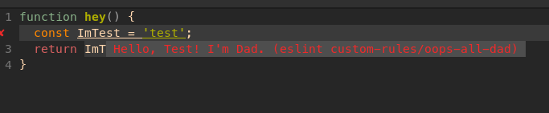

# dadJokeEslint



## but why
proof of concept for a rule that replaces var's name `somethingImTired` with `dad` and shows a suggestion `Hello, Tired Im dad`.

## but how
```
npm i
```
open example.js in your favorite editor
